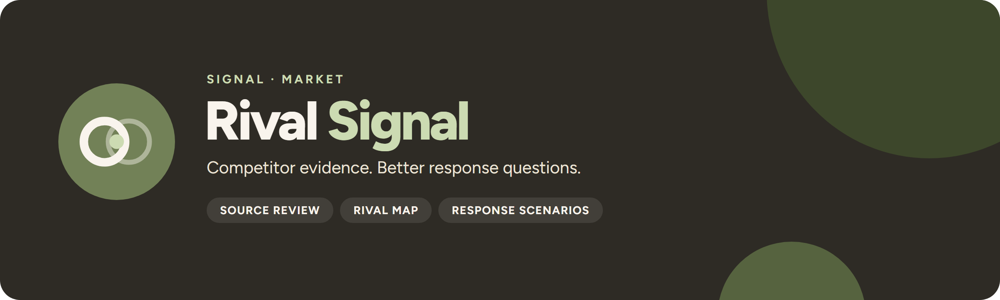

<p align="center">
  
</p>

<p align="center">
  <a href="https://github.com/UlrikErlingsen/competitor-analysis/actions"></a>
  <a href="https://github.com/UlrikErlingsen/signal-hub"></a>
  
  
  <a href="LICENSE"></a>
</p>

<p align="center"><strong>Check competitor research source by source, see where rivals overlap with you, and plan for more than one response.</strong></p>

**Rival Signal** helps marketers and strategists check competitor research before they act on it. It combines a research prompt you copy into your own AI assistant (or use as a desk-research brief), a source-by-source review of what comes back, a two-axis rival map that keeps unknowns visible, and a lab for comparing competing responses.

> Which rivals matter, and how could they respond?

Everything runs locally with open-source Python packages. There is no account, telemetry, external AI call, remote database, or built-in persistence.

## Read this first

> **A plausible competitor story is not evidence.** Rival Signal keeps every claim tied to a dated source and leaves it unknown until a person has checked it.

- **The AI step is manual.** The app writes a research prompt; you paste it into an assistant you choose and paste its JSON reply back. The app never calls an AI and never fetches a web page. Source URLs are shown as links only.
- **Imported research is a draft.** Every claim and every map cell starts unreviewed and counts as unknown until someone accepts it with a name and a note. Acceptance records a source-alignment judgment, not proof that the claim is true.
- **The map is weighted coding, not a threat score.** Its two axes, market overlap and capability resemblance, follow Chen (1996) and are relative to your company. A box shows the range left open by unresolved cells. It is not a confidence interval, a probability, a market share or a danger ranking, and the upper-right corner does not predict aggression.
- **Response hypotheses stay hypotheses.** Awareness, motivation and capability (Chen, Su and Tsai, 2007) are prompts for reasoning. The app does not estimate a response model, rank hypotheses or forecast what a rival will do.
- **Not found is not absent.** A capability the research could not find stays unknown. Only explicit evidence of exclusion codes a cell "no".

## Scope

**Version 1.0 supports:**

- a research brief (focal company, market boundary, planned move, as-of date, response horizon) with weighted market and resource criteria (at least one of each) and any number of named rivals, including indirect rivals, potential entrants and substitutes;
- a copyable research prompt and JSON schema for any AI assistant, with the brief, criteria, rivals and an all-unknown skeleton embedded, and a repair prompt when a reply fails validation;
- strict import of the reply: JSON Schema validation, cross-reference checks, date logic, safe public links, and rejection of any reply that changes the brief, criteria or rivals you set;
- human review of each claim and each coding cell, with reviewer, note and date, and an evidence age limit based on when the evidence was observed, not when the page was opened;
- a rival map with lower and upper bounds per axis, a ranked list of unresolved questions, and every coded cell with its reason;
- response hypotheses with awareness, motivation, capability, supporting and counter observations, a signal to watch, a contingency, an owner and a next-check date;
- a comparison of two saved snapshots, a printable HTML brief and a ZIP evidence pack.

**It does not:** search the web, call an AI, scrape or monitor sources, verify that a claim is true, detect syndicated copies automatically, authenticate reviewers, estimate market shares or response probabilities, rank rivals by danger, send reminders, or save anything unless you download it. Media coverage and share of voice are **[Listen Signal](https://github.com/UlrikErlingsen/media-listening)**'s job, customer perceptions and perceptual maps **[Position Signal](https://github.com/UlrikErlingsen/brand-positioning)**'s, finding customer companies **[Prospect Signal](https://github.com/UlrikErlingsen/b2b-prospecting)**'s, and the investment decision itself **[Gate Signal](https://github.com/UlrikErlingsen/launch-decision-gate)**'s. Demand, price and cannibalization estimates belong in **[Choice Signal](https://github.com/UlrikErlingsen/conjoint-analysis)**, **[Tag Signal](https://github.com/UlrikErlingsen/pricing-analysis)** and **[Shift Signal](https://github.com/UlrikErlingsen/cannibalization-analysis)**.

## Try the demo in three minutes

1. Start the app. **Overview** opens on a fictional case: FjordDesk, a Norwegian job-scheduling supplier, plans a fixed-price dispatch package and faces three invented rivals (RoutePilot, SuiteWorks and a spreadsheet-and-phone substitute).
2. Open **3 · Rival map**. SuiteWorks is a dot: all its cells are resolved (70% market overlap, 65% capability resemblance). RoutePilot is a box, 80–100 on market because one criterion is unknown and 75–100 on capability because its accounting-integration evidence is 240 days old against a 180-day limit. The substitute spans 0–50 on market because its key cell rests on an inference.
3. Open **2 · Import & review**, raise **Maximum evidence age in days** to 365 and update. RoutePilot's old evidence becomes current and its capability range closes at 100.
4. Open **4 · Response lab** for RoutePilot's two competing hypotheses, discount or hold, each citing the other's support as counterevidence.
5. Open **5 · Compare & export** and download the printable brief or the evidence ZIP.

To try the import itself, open **2 · Import & review**, download **a fictional AI response to try**, and paste or upload it: it loads with every review cleared and every cell unknown.

The demo is invented data generated in code. FjordDesk, RoutePilot, SuiteWorks, their evidence, sources (`rival-demo.example` URLs) and review decisions represent no real company, product, course case or empirical finding.

## Data contract

One UTF-8 JSON object per case, pasted or uploaded. A research reply follows `schema_version` 1.0 with seven parts:

| Part | One record per | Key fields | Required |
|---|---|---|---|
| `brief` | case | `focal_company`, `market`, `decision`, `as_of`, `horizon_days` | 1 |
| `criteria` | comparison criterion | `id`, `dimension` (`market` or `resource`), `label`, `definition`, `weight` | 2 or more, both dimensions |
| `competitors` | rival or substitute | `id`, `name`, `type` (`direct`, `indirect`, `potential`, `substitute`), `description` | 1 or more |
| `sources` | source document | `id`, `title`, `url`, `publisher`, `published_date`, `accessed_date`, `origin_group` | 0 or more |
| `claims` | statement about one rival | `id`, `competitor_id`, `kind` (`observation` or `inference`), `topic`, `statement`, `observed_date`, `source_ids` | 0 or more |
| `assessments` | rival × criterion | `competitor_id`, `criterion_id`, `judgment` (`yes`, `no`, `unknown`), `claim_ids`, `rationale` | 0 or more; missing cells are unknown |
| `responses` | response hypothesis | `id`, `competitor_id`, `response`, `awareness`, `motivation`, `capability`, `supporting_claim_ids`, `counter_claim_ids`, `watch_for`, `our_contingency`, `owner`, `next_check` | 0 or more |

Every key is required and unknown keys are rejected, so a reply cannot add `verified` flags, confidence scores or review statuses.

A reply is rejected, with the reason shown, if it is not one JSON object, repeats a key or an ID, cites an unknown source, claim, rival or criterion, has an observation without a source, links an assessment or response to another rival's claims, lists a claim as both support and counterevidence, dates evidence after the as-of date, has a source accessed after the as-of date or published after it was accessed, or links to a non-public or credential-bearing URL. If you started a case from your own brief in the session, a reply that changes the brief, criteria or rivals is also rejected.

A saved project (`rivalsignal-project-v1`) wraps the same research with your review decisions, the evidence age limit and a provenance label. Restoring it keeps your reviews; importing research never does.

### Data limits

Run on your own computer, Rival Signal sets no limit on file size, number of rivals, criteria, sources, claims or hypotheses, text length or pasted text; your computer's memory is the limit, and running out of memory gives a plain message instead of a crash. Streamlit's upload cap is set to 10,000 MB. A typical reply is tens of kilobytes. Very large cases stay usable on screen: the map chart shows the first 25 rivals and the response lab the first 25 hypotheses per rival, each with a note, while tables, the analysis and every export keep everything. Every claim and cell still needs a human check, so the practical limit is how much you can review.

A public demo (`SIGNAL_PUBLIC=1`) applies hard caps to protect a shared server: 10 MB of JSON, 1,000,000 pasted characters, 12 rivals, 24 criteria, 100 sources, 300 claims, 36 hypotheses, 20 cited IDs per record and per-field text lengths. Those messages say they are demo limits. All caps live in `src/rivalsignal/limits.py`.

See the [data guide](docs/data-guide.md).

## Analysis contract

The brief and criteria are fixed before research starts and travel inside the prompt. Market criteria describe markets you serve; resource criteria describe capabilities you have. Weights express importance within each dimension and are normalised separately. The as-of date is the evidence cutoff, and the evidence age limit (180 days by default) decides when an observation is too old to count. Both are set in the app and saved with the project, so a later reader sees the basis the map was drawn on.

## Methods

1. **Brief and prompt.** The prompt embeds the brief, criteria and rivals with an all-unknown assessment grid, and sets evidence rules: separate observations from inferences, cite sources, date evidence by when it happened, never treat missing evidence as "no", propose at least two response hypotheses with evidence for and against.
2. **Import.** JSON Schema (draft 2020-12) validation, then cross-reference, date and link checks. AI content cannot create review decisions.
3. **Review.** A claim counts only if it is accepted, is an observation, cites a source, has an observed date, and is no older than the age limit at the as-of date. A cell counts only if its coding is accepted, its judgment is yes or no, and every linked claim counts. Anything else is unresolved.
4. **Map.** For each rival and dimension `d`, with criterion weights `w_i`:

   ```
   lower_d = 100 × Σ(w_i, resolved yes) / Σ(w_i in d)
   upper_d = lower_d + 100 × Σ(w_i, unresolved) / Σ(w_i in d)
   ```

   A resolved "no" lowers the upper bound; finding nothing does not. Unresolved cells are listed by weight as the next things to research.
5. **Responses.** Each hypothesis shows which linked observations currently count, which are unresolved, which fields are still empty, and whether its next check is due at the as-of date.
6. **Snapshots.** Two saved projects are compared record by record. Changes in the map bounds are shown only when the brief (apart from the as-of date), criteria, weights, rivals and age limit are identical; otherwise the numbers are withheld because the basis differs.

See [methods](docs/methods.md).

## Decision statuses

Rival Signal returns no threat score and no go/no-go. Each map cell ends in one of these states, shown with its reason:

- **Resolved yes / resolved no:** reviewed coding backed only by reviewed, current observations.
- **Unresolved:** no assessment supplied, judgment unknown, coding awaiting review or rejected, no linked observation, or a linked claim that is awaiting review, rejected, an inference, unsourced, undated, dated after the as-of date, or older than the age limit.

Each response hypothesis also shows **check due** when its next-check date has arrived, and **still to define** for empty reasoning, signal, contingency, owner or date fields.

## Exports

**5 · Compare & export** offers:

- `rival-project.json`: the full project with reviews, for restoring later;
- `rival-competitor-brief.html`: a printable, self-contained brief with the case, profiles, criteria, unresolved questions, response hypotheses, evidence ledger, sources, limits, method references, app version and project SHA-256;
- `rival-evidence.zip`: `project.json`, `research-draft.json` (research without reviews), `brief.html`, `profiles.csv`, `cells.csv`, `claims.csv`, `gaps.csv` and `method.json` (version, project SHA-256, references and limits).

**1 · Brief & AI prompt** also downloads the research prompt as text and the JSON schema. The exports contain your brief, sources and reviewer names, so share them as you would the research itself. In CSV files, text that begins with `=`, `+`, `-` or `@` (after leading spaces) is prefixed with an apostrophe against spreadsheet-formula interpretation, and the HTML brief escapes all imported text.

## Run locally

You need Python 3.10 or newer and a local copy of this folder.

**macOS:** double-click `run_app.command`. **Windows:** double-click `run_app.bat`.

The first launch creates a private `.venv` and downloads open-source dependencies. Later launches reuse it. Or use a terminal:

```bash
python3 -m venv .venv
source .venv/bin/activate  # Windows: .venv\Scripts\activate
python -m pip install -r requirements.txt
python -m streamlit run app.py
```

Rival Signal prefers local port 8598; the macOS launcher falls back to another free port if it is taken. Both launchers accept `RIVALSIGNAL_PORT` and `RIVALSIGNAL_MAX_UPLOAD_MB` (default 10000), and the macOS launcher also accepts `RIVALSIGNAL_NO_BROWSER=1`. Started from a terminal, the app reads the same 10,000 MB upload cap from `.streamlit/config.toml`.

### Docker

```bash
docker build -t rivalsignal .
docker run --rm -p 8598:8598 rivalsignal
```

Then open http://127.0.0.1:8598. The container runs as a non-root user and sets the upload cap with `STREAMLIT_SERVER_MAX_UPLOAD_SIZE=10000`; pass `-e STREAMLIT_SERVER_MAX_UPLOAD_SIZE=<MB>` to change it.

## Privacy

The app processes your brief, research and reviews in memory and sends nothing anywhere; the only data that leaves your computer is what you choose to paste into an AI assistant, under that provider's terms. Inside Signal Hub it writes no files and makes no network calls, and on any hosted deployment the operator is responsible for transport security, access control, logs and retention. See [PRIVACY.md](PRIVACY.md).

## No install? Give this file to an AI

[AI_ANALYST.md](AI_ANALYST.md) is a standalone analysis protocol for a capable AI assistant, with the same scope limits, review rules, calculations and honesty rules. The local app is the more private option: a cloud AI sees whatever you upload or paste.

## Development

```bash
python -m pip install -e ".[test]"
python -m pytest
python -m ruff check .
python -m build
```

The analysis core installs without Streamlit or Plotly; `pip install -e ".[ui]"` adds the app dependencies. Tests cover the draft-only import, two-step review before a cell resolves, the demo's known bounds, per-dimension weight normalisation, evidence ageing, unsafe links, scope drift and inconsistent references, no data limits locally and hard caps with `SIGNAL_PUBLIC=1`, project round trips, snapshot comparability, escaped HTML and spreadsheet-safe CSV, every Streamlit page and its main flows, and the Signal Hub contract (`rivalsignal.ui.render`, namespaced keys, Hub mode, no network or file calls, no repo-root file reads).

## Where this fits in Signal

Rival Signal works from company evidence about named rivals. Use **[Listen Signal](https://github.com/UlrikErlingsen/media-listening)** to see how rivals are covered in the media, **[Position Signal](https://github.com/UlrikErlingsen/brand-positioning)** when the question is how customers perceive brands against each other, **[Prospect Signal](https://github.com/UlrikErlingsen/b2b-prospecting)** to find customer companies rather than rivals, and take the response contingencies into **[Gate Signal](https://github.com/UlrikErlingsen/launch-decision-gate)** when the move needs an investment decision.

<!-- signal-suite:start (generated from signal-hub/apps.yaml by scripts/sync_readme_suite.py) -->
| Family | App | Asks |
|---|---|---|
| Brand | [Track Signal](https://github.com/UlrikErlingsen/brand-tracking) | Is the brand moving, or is the tracker just noisy? |
| Brand | [Position Signal](https://github.com/UlrikErlingsen/brand-positioning) | Where do brands sit relative to competitors? |
| Market | [Prospect Signal](https://github.com/UlrikErlingsen/b2b-prospecting) | Which Norwegian companies fit your ideal customer, and which first? |
| Market | [Listen Signal](https://github.com/UlrikErlingsen/media-listening) | Who is talking about the brand in Norwegian media, and in what tone? |
| Market | [Influence Signal](https://github.com/UlrikErlingsen/influencer-campaigns) | Which creators delivered, and was every post labelled properly? |
| Market | [Season Signal](https://github.com/UlrikErlingsen/marketing-calendar) | What does the Norwegian marketing year look like, worked backwards? |
| Market | [Adopt Signal](https://github.com/UlrikErlingsen/adoption-forecasting) | When will a new product be adopted? |
| Market | **Rival Signal** (this app) | Which rivals matter, and how could they respond? |
| Market | [Reach Signal](https://github.com/UlrikErlingsen/location-catchment-analysis) | Where could a new location reach, and how would it share demand with existing sites? |
| Customer | [Worth Signal](https://github.com/UlrikErlingsen/customer-value-analytics) | What are customers and relationships worth? |
| Customer | [Segment Signal](https://github.com/UlrikErlingsen/customer-segmentation) | Do customers form stable, useful groups? |
| Customer | [Trace Signal](https://github.com/UlrikErlingsen/journey-path-analysis) | How do logged customer journeys actually unfold? |
| Customer | [Blueprint Signal](https://github.com/UlrikErlingsen/service-blueprinting) | How is the customer experience actually delivered, and where do the handoffs fail? |
| Customer | [Recommend Signal](https://github.com/UlrikErlingsen/recommender-evaluation) | Which recommendation policy should be tested live? |
| Research | [Choice Signal](https://github.com/UlrikErlingsen/conjoint-analysis) | How do product attributes drive choice? |
| Research | [Driver Signal](https://github.com/UlrikErlingsen/survey-driver-analysis) | Which measured experiences move with satisfaction? |
| Research | [Measure Signal](https://github.com/UlrikErlingsen/measurement-validation) | Does a multi-item score have a defensible structure? |
| Research | [Text Signal](https://github.com/UlrikErlingsen/open-text-analysis) | What recurring patterns appear in open-ended responses? |
| Research | [Tag Signal](https://github.com/UlrikErlingsen/pricing-analysis) | What price range is supported, and how does profit move? |
| Research | [Learn Signal](https://github.com/UlrikErlingsen/research-prioritization) | Which uncertainty is worth paying to research before you decide? |
| Decide | [Experiment Signal](https://github.com/UlrikErlingsen/experiment-analysis) | Did the treatment cause a practically meaningful change? |
| Decide | [Gate Signal](https://github.com/UlrikErlingsen/launch-decision-gate) | Does a concept deserve the next investment? |
| Decide | [Shift Signal](https://github.com/UlrikErlingsen/cannibalization-analysis) | Does a launch grow the portfolio, or move existing demand around? |
| Decide | [Alloc Signal](https://github.com/UlrikErlingsen/marketing-mix-allocation) | Where should the next marketing budget go? |

All 24 apps run side by side in [Signal Hub](https://github.com/UlrikErlingsen/signal-hub), each opening with fictional demo data. Every repo carries the [`signal-suite`](https://github.com/topics/signal-suite) topic, and the suite is listed at [ulrikerlingsen.com](https://ulrikerlingsen.com). Freddo CRM is a separate product.
<!-- signal-suite:end -->

## References

- Bergen, M., & Peteraf, M. A. (2002). Competitor identification and competitor analysis: A broad-based managerial approach. *Managerial and Decision Economics, 23*(4–5), 157–169. https://doi.org/10.1002/mde.1059
- Chen, M.-J. (1996). Competitor analysis and interfirm rivalry: Toward a theoretical integration. *Academy of Management Review, 21*(1). https://doi.org/10.5465/amr.1996.9602161567
- Chen, M.-J., Su, K.-H., & Tsai, W. (2007). Competitive tension: The awareness-motivation-capability perspective. *Academy of Management Journal, 50*(1), 101–118. https://doi.org/10.5465/amj.2007.24162081
- Jaźwińska, K., & Chandrasekar, A. (2025, March 6). AI search has a citation problem. *Columbia Journalism Review*, Tow Center for Digital Journalism. https://www.cjr.org/tow_center/we-compared-eight-ai-search-engines-theyre-all-bad-at-citing-news.php
- Montgomery, D. B., Moore, M. C., & Urbany, J. E. (2005). Reasoning about competitive reactions: Evidence from executives. *Marketing Science, 24*(1), 138–149. https://doi.org/10.1287/mksc.1040.0076

The academic works shape the questions the app asks: two separate axes relative to a focal firm, a broad view of who competes, awareness, motivation and capability as distinct prompts, and the habit of reasoning about reactions explicitly. None of them validates the app's yes/no coding, its weights, its age limit or the usefulness of its bounds. The Tow Center report is a 2025 test of AI search tools citing news articles, not a study of competitor research; it motivates the review step, not an error rate.

## Originality and license

Rival Signal is an independent implementation based on public research literature and original synthetic examples. It does not reproduce lecture slides, institution-specific cases, teaching diagrams, exercises, exam questions, screenshots, tables or other institution-specific teaching material. See [sources and originality](docs/sources-and-originality.md).

The software and documentation are free under AGPL-3.0-or-later. The license covers this project's expression, not ownership of published methods or frameworks.

This application was developed with AI coding assistance and checked through source review, analytical fixtures, deterministic synthetic tests, automated app tests and visual inspection. Verify material decisions independently; no warranty is provided.

---

<p>
  
  <strong>Rival Signal</strong> is part of <a href="https://github.com/UlrikErlingsen/signal-hub"><strong>Signal</strong></a>, open marketing-evidence tools by <a href="https://ulrikerlingsen.com">Ulrik Erlingsen</a>.
</p>
